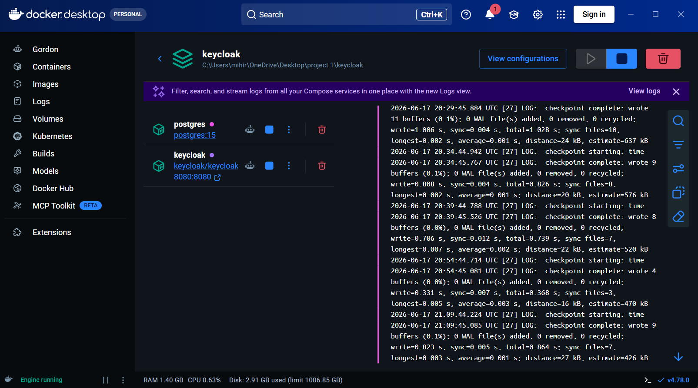
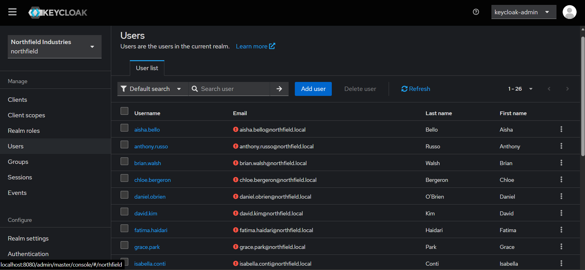
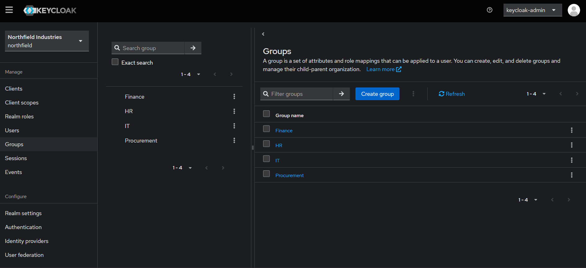
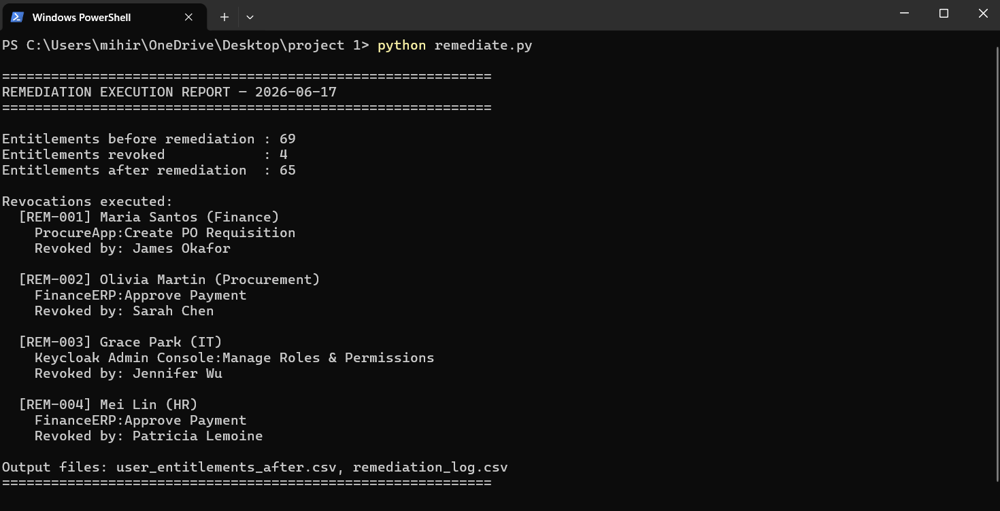

# IAM Governance & Access Review Program (Simulated)

A simulated enterprise IAM governance program for a fictional 26-person, 4-department organization — built end-to-end to mirror how a real access governance function operates, not just to deploy an IdP.

**Scope:** org design → RBAC → identity platform deployment (Keycloak) → segregation-of-duties (SoD) enforcement → access certification campaign → remediation → control mapping (ISO 27001 A.9 / NIST 800-53 AC).

---

## Project Phases

- [x] **Phase 1** — Org design & RBAC matrix
- [x] **Phase 2** — Keycloak deployment (IdP, realms, groups, users)
- [x] **Phase 3** — SoD ruleset definition
- [x] **Phase 4** — Simulated access certification campaign
- [x] **Phase 5** — Remediation & control mapping (ISO 27001 A.9, NIST 800-53 AC family)
- [x] **Phase 6** — Before/after report, architecture diagram, final write-up

---

## Phase 2 — Identity Platform (Keycloak on Docker)

Keycloak 26 deployed via Docker Compose with PostgreSQL backend. The `northfield` realm was provisioned via infrastructure-as-code (realm import JSON) — 26 users, 16 roles, 4 department groups.

**Docker Desktop — both containers running (Keycloak + PostgreSQL)**

**Keycloak — 26 users provisioned in the northfield realm**

**Keycloak — 16 realm roles across 4 departments**

**Keycloak — 4 department groups (Finance, HR, IT, Procurement)**

---

## Phase 3 & 4 — SoD Detection & Access Certification

A Python script scans all 69 entitlements across 26 users against the SoD ruleset and RBAC baseline. 9 violations were found across 5 users — including 1 Critical fraud-enabling combination where a single user could create a vendor AND approve payment to it.

**SoD violation detection — 9 violations found across 5 users**

### Violations Found

| User | Violation | Risk |
|---|---|---|
| Olivia Martin | Create Vendor + Approve Payment — complete fraud loop | Critical |
| Robert Hayes | Create PO + Approve PO — self-approval | High |
| Nora Fitzgerald | Create PO + Approve PO — self-approval | High |
| Olivia Martin | Non-Finance user holds Approve Payment | High |
| Mei Lin | Non-Finance user holds Approve Payment | High |
| Maria Santos | ProcureApp access outside Finance Analyst baseline | Medium |
| Olivia Martin | Approve Payment outside Vendor Manager baseline | Medium |
| Grace Park | Manage Roles & Permissions on IT Support account | Medium |
| Mei Lin | Approve Payment outside HR Coordinator baseline | Medium |

**Access certification campaign — 69 entitlements reviewed, 5 revoked, 4 exceptions**

---

## Phase 5 — Remediation

4 entitlements revoked with full audit trail — every revocation logged with reviewer identity, date, and justification. 4 design-time SoD conflicts accepted with documented compensating controls.

**Remediation execution — 4 entitlements revoked**

### Revocations Executed

| User | Entitlement Revoked | Revoked By | Reason |
|---|---|---|---|
| Maria Santos | ProcureApp:Create PO Requisition | James Okafor | Outside Finance Analyst baseline |
| Olivia Martin | FinanceERP:Approve Payment | Sarah Chen | Critical SOD-01 — fraud loop |
| Grace Park | Keycloak:Manage Roles & Permissions | Jennifer Wu | IT Support has no IAM admin need |
| Mei Lin | FinanceERP:Approve Payment | Patricia Lemoine | HR with Finance approval authority |

**Result: 69 → 65 entitlements. All Critical and High drift violations remediated.**

### Exceptions Granted (with Compensating Controls)

| User | Conflict | Control |
|---|---|---|
| Robert Hayes | PO self-approval (role design) | PO approvals above $50k require CFO counter-sign |
| Nora Fitzgerald | PO self-approval (role design) | Monthly PO review by Procurement Director |

---

## Phase 5 — Control Mapping

Every project activity mapped to ISO 27001 A.9 and NIST 800-53 AC controls with evidence artifacts.

### ISO 27001 A.9

| Control | Name | Evidence |
|---|---|---|
| A.9.1.1 | Access Control Policy | rbac_matrix.csv |
| A.9.2.1 | User Registration | users.csv + northfield-realm.json |
| A.9.2.2 | User Access Provisioning | remediation_log.csv |
| A.9.2.5 | Review of User Access Rights | access_certification.csv |
| A.9.2.6 | Removal of Access Rights | remediation_log.csv |
| A.9.4.1 | Information Access Restriction | sod_rules.csv + sod_violations.csv |

### NIST 800-53 AC Family

| Control | Name | Evidence |
|---|---|---|
| AC-1 | Access Control Policy | org-design.md |
| AC-2 | Account Management | access_certification.csv |
| AC-3 | Access Enforcement | user_entitlements_after.csv |
| AC-5 | Separation of Duties | sod_rules.csv + sod_violations.csv |
| AC-6 | Least Privilege | rbac_matrix.csv + remediation_log.csv |
| AU-2 | Event Logging | remediation_log.csv |

---

## Before vs After

| Metric | Before | After |
|---|---|---|
| Total entitlements | 69 | 65 |
| SoD violations | 9 | 1 (accepted with compensating controls) |
| Critical violations | 1 | 0 |
| High violations | 4 | 2 (exceptions with controls) |
| Entitlement drift | 4 users | 0 |
| Undocumented cross-dept access | 3 instances | 0 |

---

## Repo Structure

| File | Description |
|---|---|
| `org-design.md` | Department structure, role hierarchy, entitlement catalog |
| `roles.csv` | 16 role definitions across 4 departments |
| `users.csv` | 26 simulated users |
| `rbac_matrix.csv` | Least-privilege baseline: role → system → entitlement |
| `user_entitlements.csv` | Before state — actual access with violations |
| `user_entitlements_after.csv` | After state — clean post-remediation access |
| `sod_rules.csv` | 4 SoD rules with risk levels |
| `sod_violations.csv` | 9 violations detected |
| `access_certification.csv` | Full certification campaign — 69 entitlements reviewed |
| `remediation_log.csv` | 4 revocations with reviewer and justification |
| `control_mapping.csv` | 14 controls mapped to ISO 27001 / NIST 800-53 |
| `final_report.md` | Complete before/after report |
| `keycloak/docker-compose.yml` | Keycloak + PostgreSQL deployment |
| `keycloak/northfield-realm.json` | Realm definition — roles, groups, 26 users |
| `detect_violations.py` | SoD detection script |
| `remediate.py` | Remediation execution script |
| `certification_summary.py` | Certification campaign summary |

---

## Why This Exists

Most IAM portfolio projects stop at "I deployed an IdP." This one simulates the governance *program* around it: defining least privilege, catching where reality drifts from policy, and producing the artifacts (matrices, certification reports, control mappings) that a GRC/IAM analyst actually produces in the role.

---

## Related Projects

- [AI Security Guardrails](https://github.com/MR2300/ai-security-guardrails) — RAG document assistant demonstrating OWASP LLM06, with pre-retrieval access controls, redaction, and audit logging
- [Active Directory Lab](https://github.com/MR2300/active-directory-lab) — Windows Server DC + Ubuntu workstation, cross-platform AD authentication, Group Policy, security monitoring
